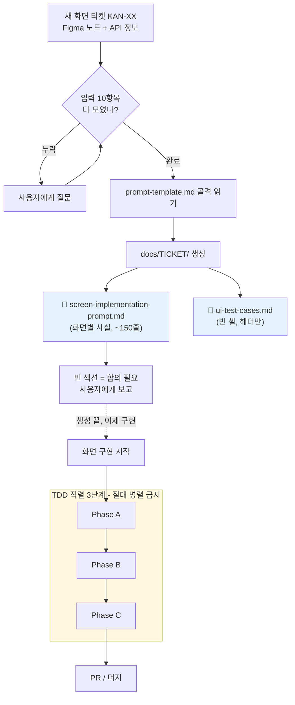
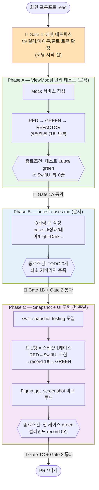
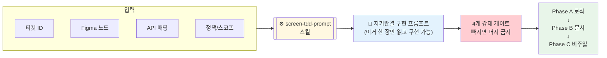

# screen-tdd-prompt 스킬 다이어그램

> `screen-tdd-prompt` 스킬의 동작과 TDD A→B→C 3단계를 그림으로 정리한 문서.
> Mermaid 문법 — GitHub / Notion / 대부분의 마크다운 뷰어에서 렌더링된다.

## 한 줄 요약

새 화면 티켓(KAN-XX) → **TDD 게이트가 강제된 자기완결 구현 프롬프트 MD**로 변환하는 스킬.
실제 화면을 구현하는 게 아니라, 구현 설계도를 찍어낸다.

---

## 1. 스킬 전체 흐름 — "프롬프트 생성 → 화면 구현"

---

## 2. A→B→C 단계 + 게이트 상세

---

## 3. 핵심 개념 한 장 요약

---

## 단계별 정리표

| | Phase A | Phase B | Phase C |
|---|---|---|---|
| 산출물 | ViewModel + 단위 테스트 | `ui-test-cases.md` 표 | SwiftUI 뷰 + 스냅샷 테스트 |
| 성격 | 로직 | 문서/계획 | 비주얼 |
| 핵심 금지 | 뷰 코드 0줄 | (Phase A 끝나야 진입) | 블라인드 record |
| 운용 가이드 | `docs/phases/phase-a-viewmodel-tdd.md` | `docs/phases/phase-b-ui-cases.md` | `docs/phases/phase-c-snapshot.md` |

## 4개 게이트

| Gate | 무엇 | 왜 |
|---|---|---|
| **1** | TDD A→B→C 직렬 3단계 | 단계 격리 없으면 회귀 보호 무력화 |
| **2** | `ui-test-cases.md` 작성 | 스냅샷 매트릭스의 단일 진실 소스 |
| **3** | swift-snapshot-testing | 비주얼 회귀를 테스트가 잡는 마지막 방어선 |
| **4** | 에셋 입력 매트릭스 | 코딩 후 Figma 재방문 비용 폭발 방지 |

> **왜 직렬인가**: 단계를 섞으면 A에서 뷰를 손대고 B 없이 스냅샷을 찍게 되어,
> 표가 사후 합리화 문서로 전락하고 회귀 보호가 무력화된다.
